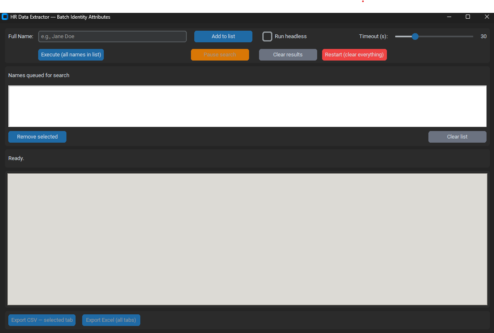

# HR Data Extraction Desktop App

> 📐 **For a deep dive into the technical decisions, see [`docs/architecture.md`](docs/architecture.md).**

> A Python desktop application that automates employee data extraction from a web-based HR/Identity Management system, reducing per-user lookup time from **20–60 minutes to ~1.5 minutes** (up to **95% faster**).


---

## 📌 Business Problem

Operations and compliance teams routinely need to retrieve **employee identity attributes** (department, role, access groups, manager, etc.) from a corporate Identity Management system. The original process was fully manual:

- Log in to the system
- Search each employee individually
- Navigate through multiple tabs
- Manually copy attributes into a spreadsheet

**Average time per employee:** 20–60 minutes  
**Pain points:** repetitive, error-prone, not scalable, blocked analytical work

---

## 💡 Solution

A standalone desktop application that automates the entire workflow:

1. User enters a **list of employee names** through the GUI
2. App launches a Selenium-driven browser session
3. Sequentially scrapes identity attributes for each user
4. Displays results in **per-user tabs** with sortable tables
5. Exports to **CSV (single user)** or **Excel (all users, one sheet each)** with a single click

### 📊 Impact

| Metric | Before | After | Improvement |
|---|---|---|---|
| Time per employee | 20–60 min | ~1.5 min | **up to 95% faster** |
| Human errors | Frequent | ~0 | Standardized output |
| Scalability | Linear with users | Batch (N users) | Unbounded |

---

## 🎬 Demo


### Screenshots

| Main Window | Results View |
|---|---|
|  |  |

---

## 🛠️ Tech Stack

| Layer | Technology |
|---|---|
| Language | Python 3.10+ |
| GUI | CustomTkinter, Tkinter (ttk.Notebook, ttk.Treeview) |
| Browser Automation | Selenium 4 (Selenium Manager — no manual driver) |
| Data Handling | Pandas, openpyxl |
| Concurrency | Threading (non-blocking GUI) |
| Configuration | python-dotenv (`.env`) |

---

## 🏗️ Architecture

```
┌─────────────────┐      ┌──────────────────┐      ┌──────────────────┐
│  CustomTkinter  │─────▶│   Threading      │─────▶│  Selenium Driver │
│  GUI Layer      │      │   Worker         │      │  (Chrome)        │
└─────────────────┘      └──────────────────┘      └──────────────────┘
        │                         │                         │
        │                         ▼                         ▼
        │                ┌──────────────────┐      ┌──────────────────┐
        │                │  Robust Waits    │      │  Target Web App  │
        │                │  (DOM idle,      │      │  (HR System)     │
        │                │   overlays, etc) │      │                  │
        │                └──────────────────┘      └──────────────────┘
        ▼                         │
┌─────────────────┐               ▼
│  Pandas         │      ┌──────────────────┐
│  DataFrames     │◀─────│  HTML Parsing    │
│  (per user)     │      │  (XPath/CSS)     │
└────────┬────────┘      └──────────────────┘
         │
         ▼
┌─────────────────┐
│  Export Layer   │
│  CSV / Excel    │
└─────────────────┘
```

---

## ✨ Key Engineering Highlights

- **Robust DOM synchronization:** custom `wait_for_dom_idle()` detects loading overlays/spinners and only proceeds once the DOM is stable for N consecutive checks — handles flaky JS-heavy enterprise apps (Angular/JSF/PrimeFaces).
- **Multi-strategy element lookup:** cascading XPath strategies (`aria-label` → row-context → first visible) with JavaScript click fallback for elements covered by overlays.
- **Non-blocking GUI:** Selenium runs in a background thread; UI updates via `tkinter.after()` for thread safety.
- **Pause & partial export:** users can pause an in-flight batch and export already-collected results without losing progress.
- **Headless mode:** optional flag for invisible background execution.
- **Time tracking:** real-time indicator of search duration and total time (search + export).

---

## 🚀 Getting Started

### Prerequisites
- Python 3.10+
- Google Chrome installed

### Installation

```bash
git clone https://github.com/<your-username>/HR-Data_Extraction-Desktop-App.git
cd HR-Data-Extraction-Desktop-App
python -m venv .venv
source .venv/bin/activate     # Windows: .venv\Scripts\activate
pip install -r requirements.txt
```

### Configuration

Copy the example env file and fill in the target system URL and selectors:

```bash
cp .env.example .env
```

Edit `.env`:
```
TARGET_URL=https://your-hr-system.example.com/home
SEARCH_INPUT_ID=searchInput
SEARCH_BUTTON_ID=searchBtn
ATTRIBUTES_TABLE_ID=identity-attributes-data-table-container
DEFAULT_TIMEOUT=30
```

### Run

```bash
python -m src.app
```

---

## 📂 Project Structure

```
HR-Data-Extraction-Desktop-App/
├── src/
│   ├── app.py         # CustomTkinter GUI
│   ├── scraper.py     # Selenium workflow
│   ├── config.py      # Env-based configuration
│   └── utils.py       # DOM waits, formatters
├── docs/              # Architecture & screenshots
├── tests/             # Unit tests
├── requirements.txt
└── .env.example
```

---

## 🧪 Testing

```bash
pytest tests/
```

---

## ⚠️ Disclaimer

This is a generic reference implementation. The original production version targeted a specific enterprise Identity Management system and has been **fully anonymized** for public sharing — no real URLs, credentials, employee data, or proprietary selectors are exposed.

---

## 📜 License

MIT © Rafael Corte
